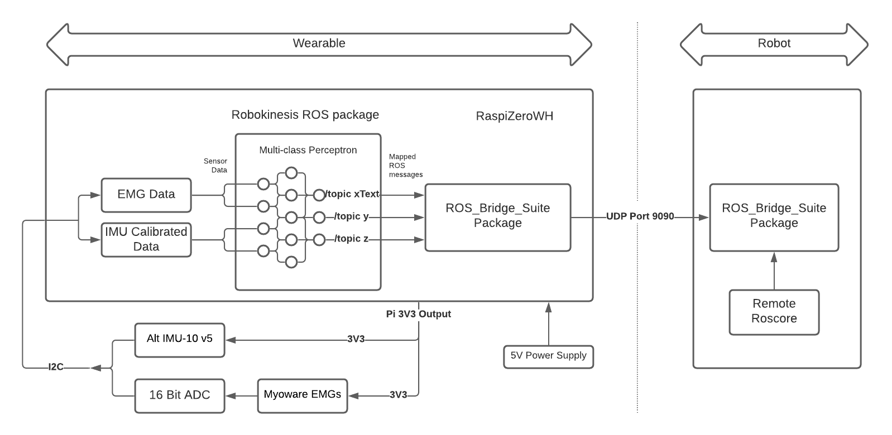
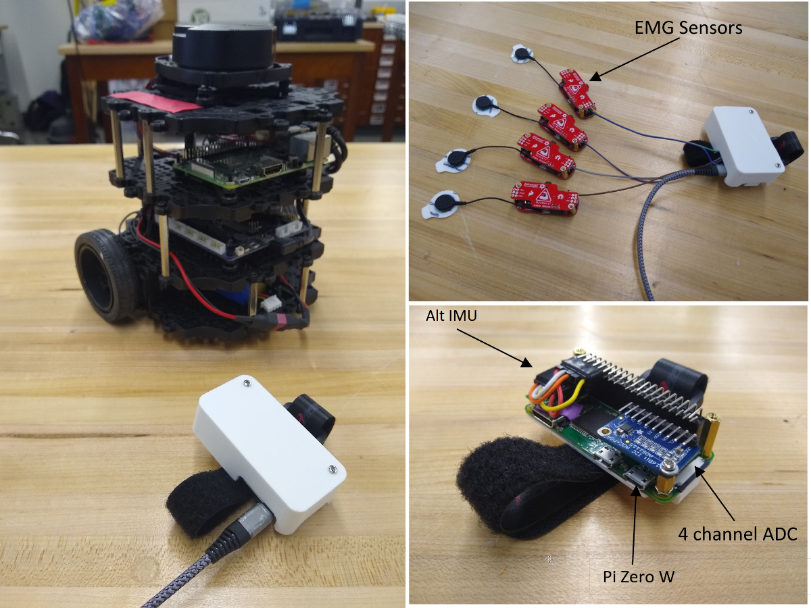

# Robokinesis

A wearable device for controlling any ROS based Robot.

## Overview

Robokinesis is a low-cost wearable device that has the potential to control or interact with any ROS-based mobile robots and manipulators. It is designed to be a general wearable device that can be used to control any robot or manipulator. The Robokinesis ROS package is also modular enough to be used with any other wearable RTOS hardware.

_The idea:_

_Package Modularity_

_Any RTOS hardware, Any sensors, Any ROS based robot_

_User-Defined number of sensor inputs, User-Defined number of mapped ROS topics_ 

- The core goal was to develop a ROS package that can be used on any sensor integrated hardware.  
- The Robokinesis ROS package maps the raw sensor data to user-defined ROS topics onboard and streams it directly to the robot at the desired frequency, without any middle agent. 

The modularity of this package and the fact that it maps to any desired topic opens an opportunity to a wide range of applications  

_Budget Hardware_

High-end wearables for controlling ROS-based robots exist, especially used in Human-robot interaction research.  But its ROS packages and SDKs are tightly coupled with its hardware that the package can't be used on low-cost alternatives or in combination with other open-source ROS packages.  

## Repository Structure

- The base directory has all robokinesis ROS package files.
- CAD files and instructions are available in [cad/ directory](https://github.com/mihyr/robokinesis/tree/main/cad).
- Schemetic files and instructions are available in [schematic/ directory](https://github.com/mihyr/robokinesis/tree/main/schematic).

## How does it work?

- Robokinesis ROS package has 2 nodes:

  - Perceptron node: uses single layer multi-class perceptron to train a model that maps the input raw sensor data to distinguishable signals  

  - Core node: maps the distinguishable sensor data to ROS topics at user-defined range and frequency  

- The Ros-Bridge-Suite package subscribes to converted ROS topics and streams to the remote robot over a WebSocket connection

The diagram below shows the entire software architecture, along with hardware connections.



## Setup Instructions

- Create a catkin workspace

    ```
    
    mkdir -p ~/catkin_ws/src
    cd ~/catkin_ws/src/
    ```

- Clone the repo into `catkin_ws/src`, build the workspace and activate it

    ```
    git clone https://github.com/mihyr/robokinesis.git
    cd ~/catkin_ws/
    catkin_make
    source ~/catkin_ws/devel/setup.zsh
    ```

## Usage Instructions

- Initialization:  
  - Define sensor inputs, desired topics, range, frequency, remote robot IP and port in the `config/params.yaml` file.

- Training & testing:
  - Create a dataset of actions and its corresponding raw sensor data  
  - Train the model using the Perceptron node, using folliwong command:

    ```
    roslaunch robokinesis train.launch
    ```
    
  - The perceptron node will train the model and save it to the `config/model.yaml` file.

- Implementation:
  - Connect the robot to the wearable's IP and port, using [rosbridge_suite](https://github.com/RobotWebTools/rosbridge_suite)
  - To control the robot, run following command on the wearable device:

    ```
    roslaunch robokinesis bringup.launch
    ```

  and control it using the trained model  

## Hardware Specs

| Component                | Specs                      |
| ------------------------ | -------------------------- |
| [AltIMU-10 v5 (Pololu)](https://www.pololu.com/product/2739)    | Acc / Gyro / Compass / Alt |
| [MyoWare Muscle Sensor v3](https://www.pololu.com/product/2732) | Raw Analog Signals         |
| [Raspberry Pi Zero WH](https://www.raspberrypi.com/products/raspberry-pi-zero-w/)    | Arch Linux Distro          |
| [Adafruit ADS1115  ADC](https://www.adafruit.com/product/1085)   | 16 Bit, 4 Channel          |


### Hardware considerations

- Pi Zero W was chosen considering its size (user can wear it), inbuilt WiFi/Bluetooth (to communicate directly to the robot, eliminating the need to have a computer in between wearable and robot), and can run ROS onboard (all computation would be done on the wearable).

- For the demo, a turtlebot3 was controlled using the wearable.

- To maneuver the turtlebot, only 4 topics are required to be mapped, hence reducing the number of distinguishable signals required to 4.

- For 4 distinguishable signals, the IMU alone is enough.

- The hardware setup with sensors IMU and muscle sensor, can give up to 9+4 distinguishable signals, and hence can be mapped to 13 different ROS topics of user’s choice.

- The fewer the number of topics required, the faster the publishing frequency will be. Hence, it’s a tradeoff for the given constraints of the hardware.

## Lessons Learned

This project allowed developing skills required for developing ROS-based packages for constrained RTOS hardware, also giving exposure to challenges like latency, sensor heating (changes calibration), etc, and tuning code to minimize error and overcome the mentioned challenges. Robotics is now penetrating domestic/consumer markets, developing a low-cost wearable project for controlling robots

The images below show the internal hardware, cased hardware, and with EMG sensors. (The device can hold up to 4 EMG sensors as the ADC is 4 channels.)



## Links

To know more about Implementation details and how to use the Robokinesis package visit: https://robokinesis.mihr.io/  


## Dependencies

Title | Link
------------ | -------------
rosbridge_suite | [Github](https://github.com/RobotWebTools/rosbridge_suite)
